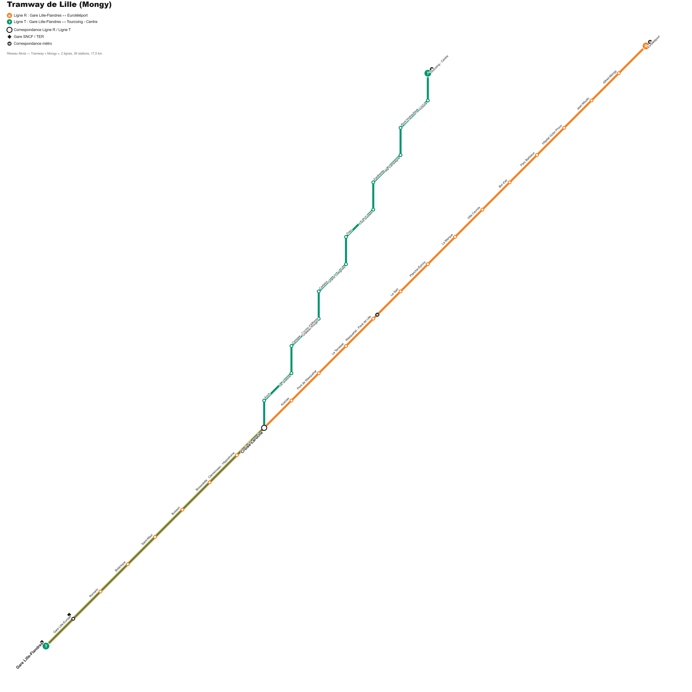
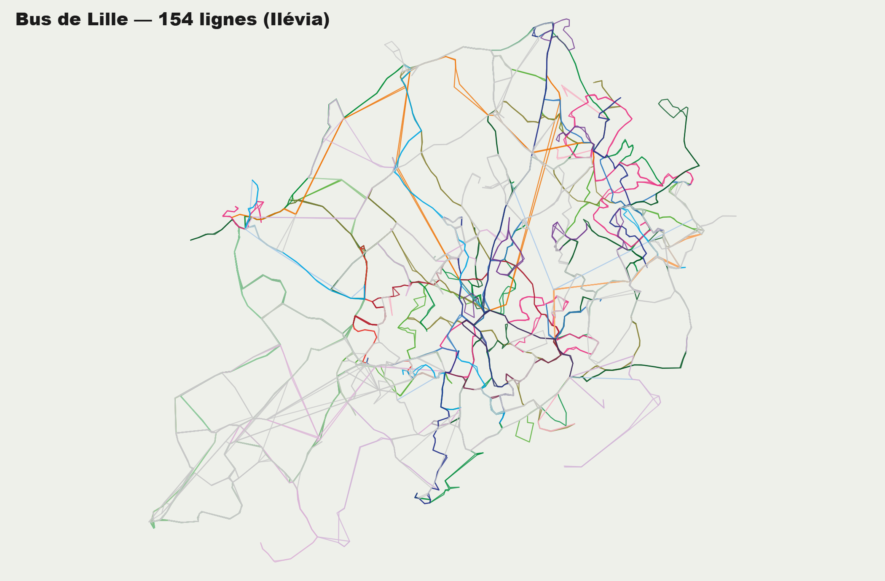
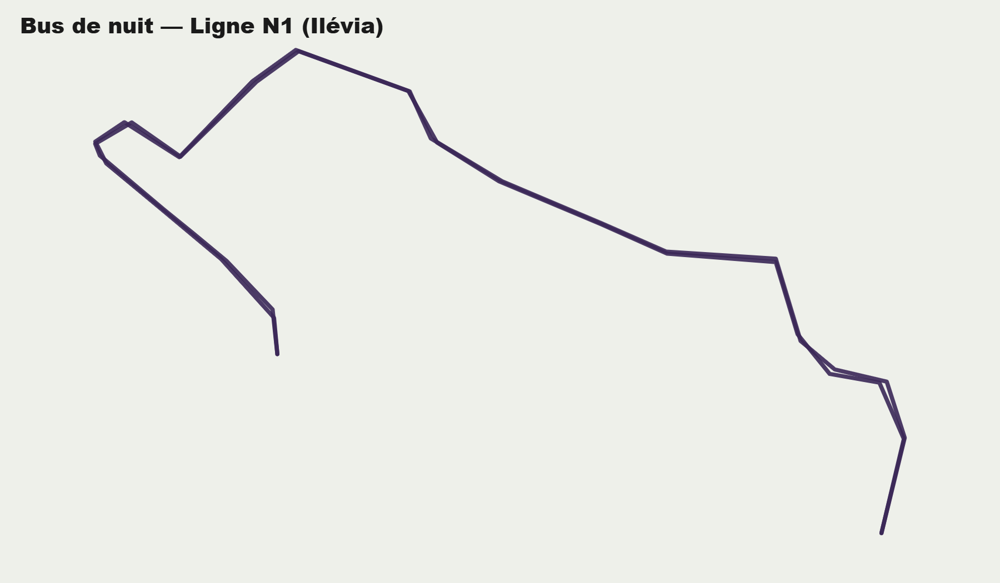
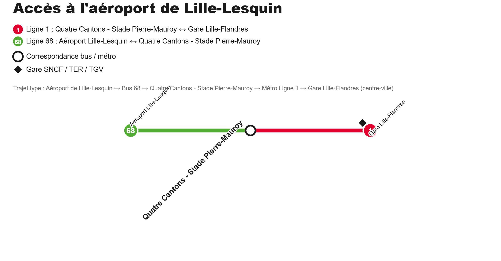

# Lille Plans

Application web statique, façon appli mobile (écran d'accueil en liste de cartes + bouton réglages), qui présente les plans des réseaux de transport de Lille — sur le modèle d'une appli « Paris Line Maps » (Metro / RER / Bus / Night bus / Airport access), adaptée au réseau lillois.

Cinq cartes sont disponibles :
- **Métro** — lignes 1 et 2, 60 stations — plan schématique façon RATP (lignes à angles de 45°/90°, stations en pastilles, correspondances en gros ronds, texte incliné), pincer-zoomer / glisser pour explorer
- **Tramway (Mongy)** — lignes R et T, 36 stations, tronc commun jusqu'à Croisé-Laroche — même style schématique
- **Bus** — 154 lignes, tracés réels sur fond de carte (OpenStreetMap via Leaflet), à partir des données ouvertes GTFS d'Ilévia, avec liste de lignes filtrable
- **Bus de nuit** — ligne N1 (Lille Porte de Douai ↔ Villeneuve-d'Ascq 4 Cantons), même carte interactive filtrée sur cette seule ligne
- **Accès aéroport** — plan schématique du trajet Aéroport de Lille-Lesquin → Bus 68 → Quatre Cantons - Stade Pierre-Mauroy → Métro Ligne 1 → Gare Lille-Flandres

| Métro | Tramway | Bus |
| --- | --- | --- |
|  |  |  |

| Bus de nuit | Accès aéroport |
| --- | --- |
|  |  |

## Utilisation

Le code web se trouve dans `www/`. Aucune dépendance à installer ni build pour le tester dans un navigateur : ouvrir `www/index.html`, ou lancer un petit serveur local :

```bash
npx serve www
```

Sur l'écran d'accueil, chaque carte ouvre le plan correspondant :
- **Métro / Tramway / Accès aéroport** : plan schématique, pincer pour zoomer et glisser pour se déplacer ([Panzoom](https://github.com/timmywil/panzoom))
- **Bus / Bus de nuit** : carte interactive (zoom/déplacement natif Leaflet) avec, en dessous, la liste des lignes groupée par famille (Lianes, Citadines, Corolle, Express, Scolaires…) et une case à cocher par ligne pour l'afficher/la masquer sur la carte

Le bouton ⚙ en bas à droite ouvre un écran **Réglages** (langue, thème clair/sombre, version, contact, politique de confidentialité).

## Données

- Métro et tramway : topologie et noms de stations issus de Wikipédia (« Ligne 1 » et « Ligne 2 du métro de Lille », « Tramway du Grand Boulevard »)
- Bus et bus de nuit : tracés issus des données ouvertes GTFS d'Ilévia ([transport.data.gouv.fr](https://transport.data.gouv.fr)), reconstruits ligne par ligne à partir des arrêts (le jeu de données ne fournit pas de tracés `shapes.txt`, donc chaque ligne relie ses arrêts par segments droits). Le script de génération est dans `data/build-bus-routes.js` ; `data/bus-routes.json` est le jeu de données utilisé par l'application (154 lignes, dont la ligne de nuit N1, filtrée pour la carte « Bus de nuit »)
- Accès aéroport : ligne de bus 68 (Aéroport Lille-Lesquin ↔ Quatre Cantons - Stade Pierre-Mauroy), identifiée dans le même GTFS, combinée schématiquement avec la ligne 1 du métro

Réseau exploité par Ilévia (Métropole Européenne de Lille).

## Appli Android

Le projet est empaqueté en appli Android via [Capacitor](https://capacitorjs.com) (dossier `android/`), qui embarque le même code que `www/` sans rien changer à l'appli web.

- **Compilation automatique** : chaque push sur `main` déclenche `.github/workflows/android-build.yml` (GitHub Actions), qui génère un APK de debug téléchargeable dans l'onglet *Actions* du dépôt (artefact `lille-plans-debug-apk`) — aucune installation locale d'Android Studio nécessaire pour tester.
- **Compilation locale** (si Android Studio est installé) :
  ```bash
  npx cap sync android
  cd android && ./gradlew assembleDebug
  ```
- **Icône / écran de démarrage** : sources dans `resources/` (`icon.png`, `splash.png`), régénérés pour Android via :
  ```bash
  npx capacitor-assets generate --android
  ```
- **Publication sur le Play Store** : nécessite un compte développeur Google Play (25$, une fois) et un APK/AAB **signé** (contrairement à l'APK de debug généré par la CI). À faire une fois le compte créé.

## Avertissement

Plans non contractuels, réalisés à titre personnel.
