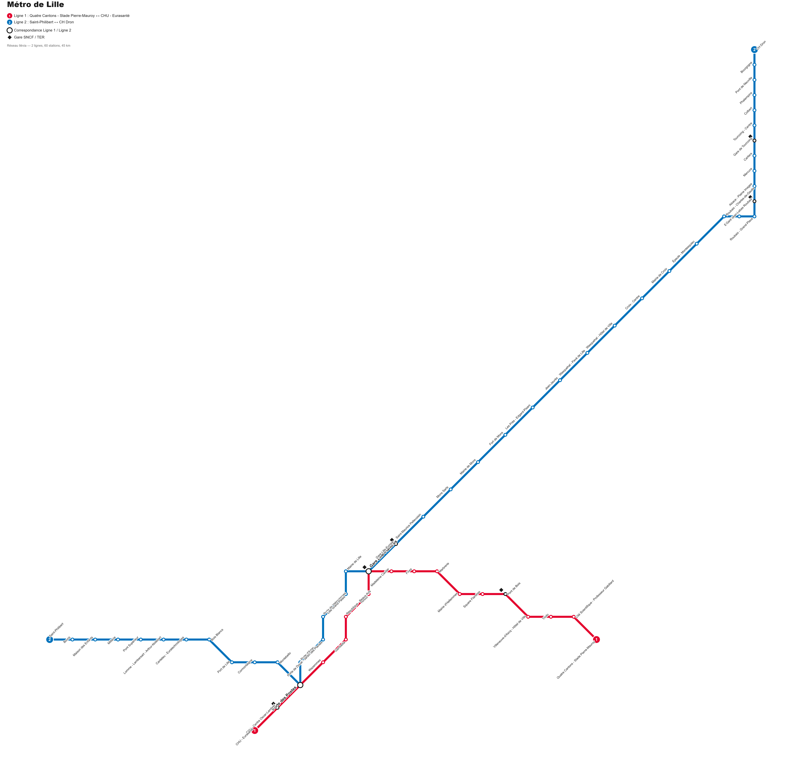

# Plan du métro de Lille

Application web statique qui génère un plan schématique du métro de Lille (2 lignes, 60 stations), dans le même style visuel que le plan du métro parisien (lignes colorées à angles de 45°/90°, stations en pastilles, correspondances en gros ronds, texte incliné). Le plan peut être téléchargé en PNG haute résolution ou en SVG vectoriel.



## Utilisation

Aucune dépendance ni build : ouvrir `index.html` dans un navigateur, ou lancer un petit serveur local :

```bash
npx serve .
```

Deux boutons permettent de télécharger le plan généré :
- **Télécharger en PNG** — export raster haute résolution
- **Télécharger en SVG** — export vectoriel éditable

## Données

Topologie et noms de stations issus de Wikipédia (« Ligne 1 » et « Ligne 2 du métro de Lille »), réseau exploité par Ilévia.

## Avertissement

Plan schématique non contractuel, réalisé à titre personnel.
